# Job board challenge - by Luiz Carneiro

This is my entry to the [Job Board challenge](./instructions/README.md)

It uses `Laravel 11.x` with `Laravel Breeze`, `AlpineJS`, `tailwindcss`, `MySQL` and `meilisearch`.
The development environment leverages Sail

## Running locally

- Make sure you have `php@8.x`, `docker` and `composer` installed
- Install the depencies:
    ```sh
    composer install
    ```
- Start the containers:
    ```sh
    ./vendor/bin/sail up -d
    ```
- Make sure `meilisearch` index is set up:
    ```sh
    ./vendor/bin/sail artisan scout:sync-index-settings
    ```
- "Migrate" the database to prepare it:
    ```sh
    ./vendor/bin/sail artisan migrate
    ```
- "Seed" the database so you can properly experience the app running:
    ```sh
    ./vendor/bin/sail artisan db:seed
    ```

## You should be all set, so access [http://localhost](http://localhost)

- Login as "Job Seeker"
    ```
    email: test@example.com
    password: abcd1234
    ```
- Login as "Admin"
    ```
    email: admin@example.com
    password: abcd1234
    ```


---

### Future considerations

This project implementation aimed to avoid re-inventing the wheel and use as much of-the-shelf software for a Laravel App.

With that said, here are some points that are worth considering for moving forward with this project:

- Scheduling for JobPosts to be auto-published and auto-unpublished
- Add support for companies logos
- Add company login feature such that their users can manage their own job postings
- Add "Apply" feature for job seekers 
    > At this point, LinkedIn should be considered a competitor! =D


## Features (with screenshots)

### Full text search! 
Wicked fast! (meilisearch powered) and with infinite scroll feature
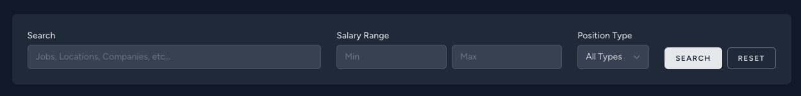
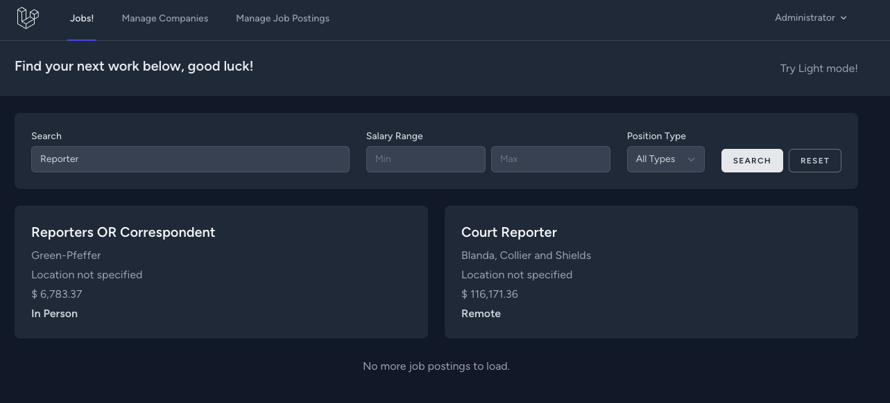

### Dark/Light mode toggle!

You can just toggle it on the top right corner or within the responsive menu

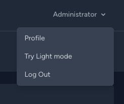
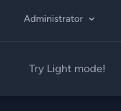
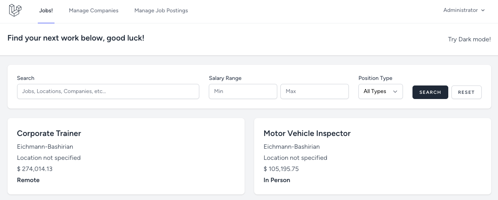
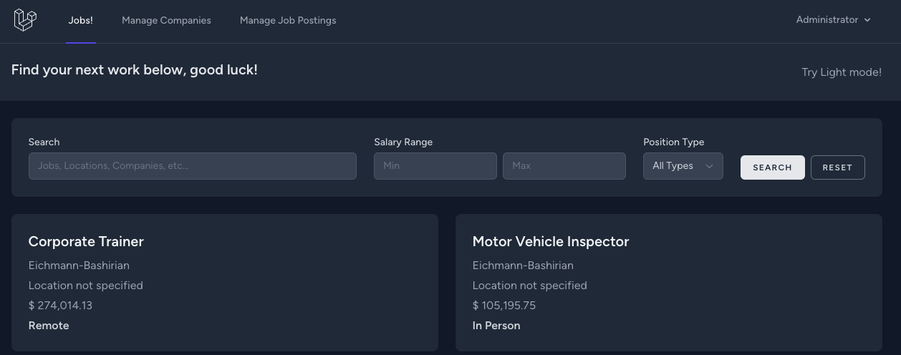

### Manage companies

Companies list with "create" modal
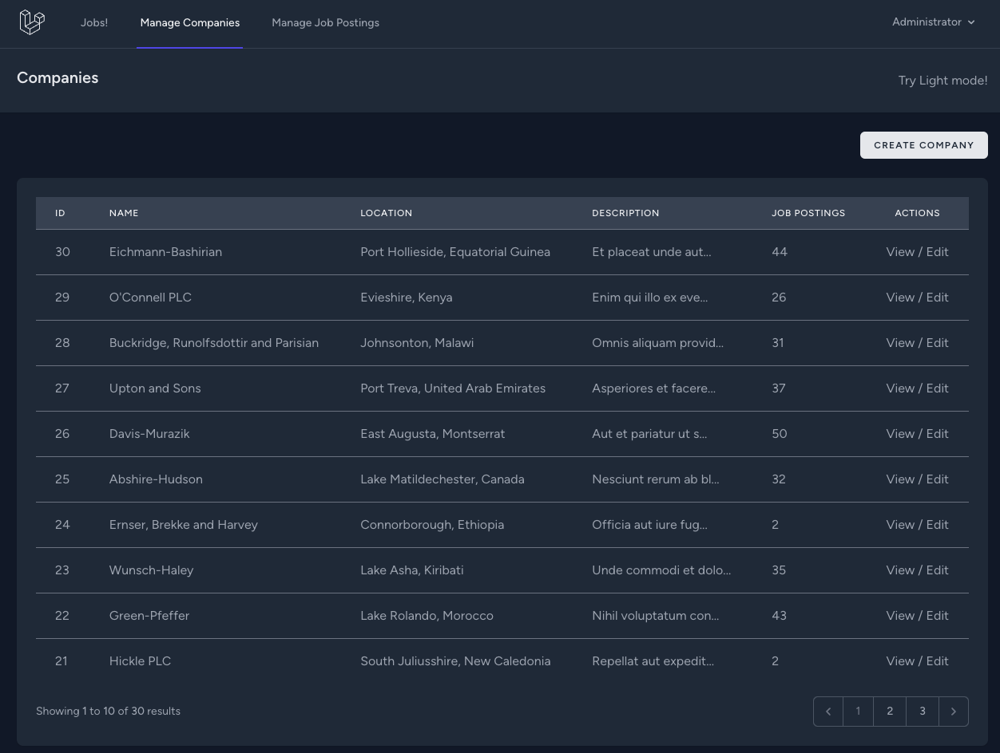
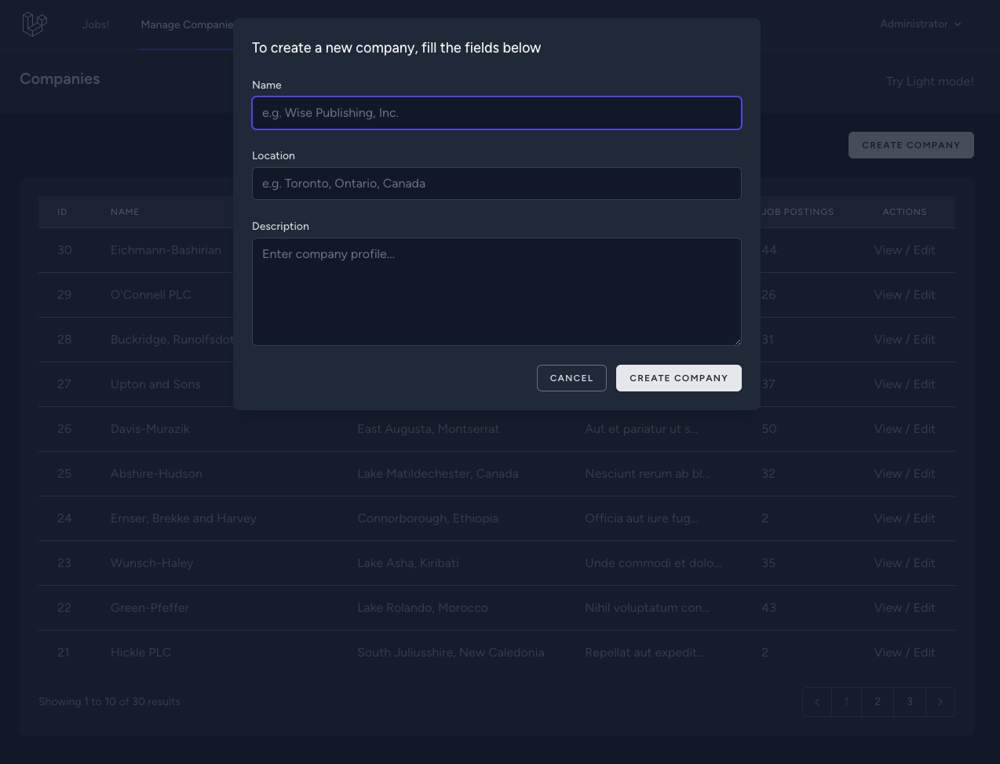

Manage company page with create job posting modal
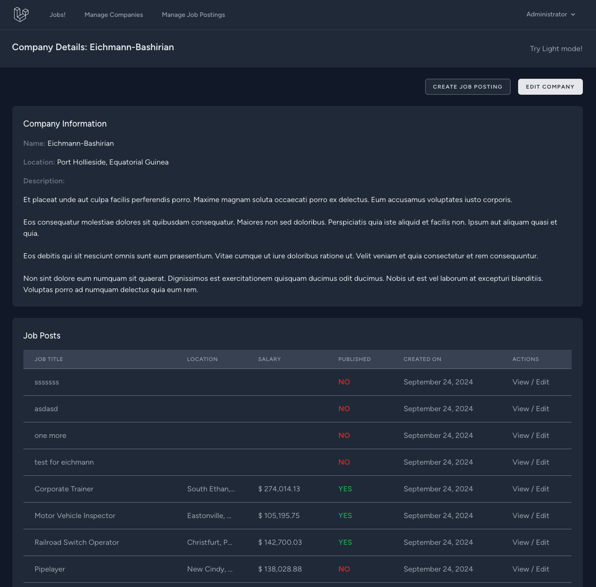
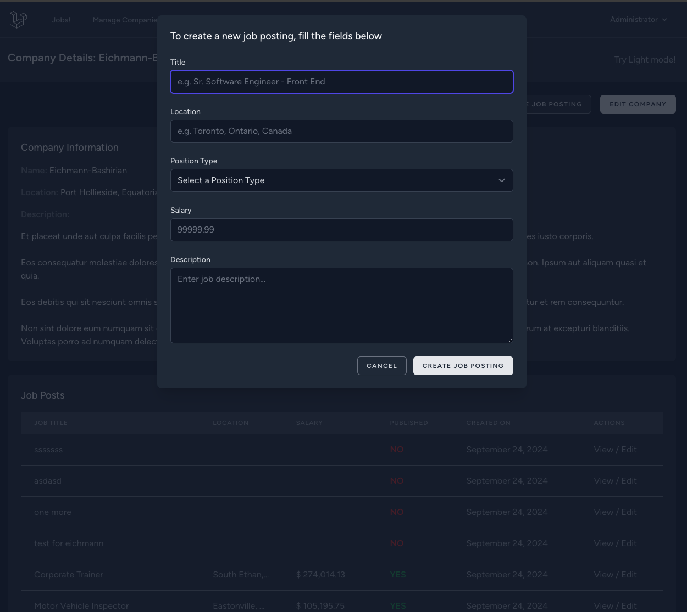

### Manage job postings

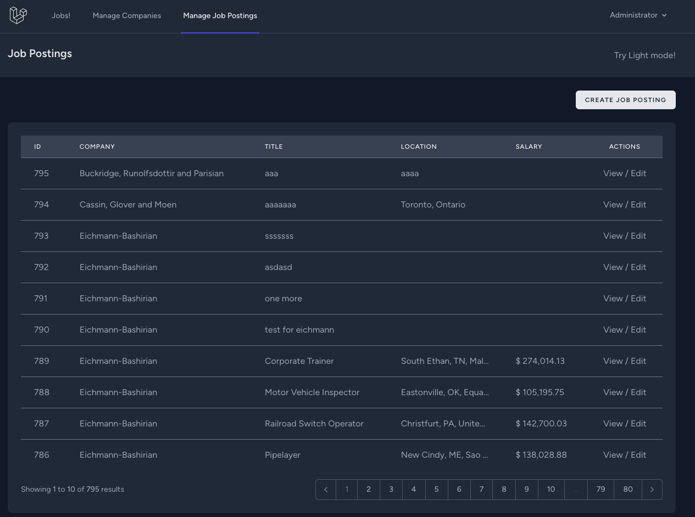

You can edit, publish and unpublish them! (top right corner)
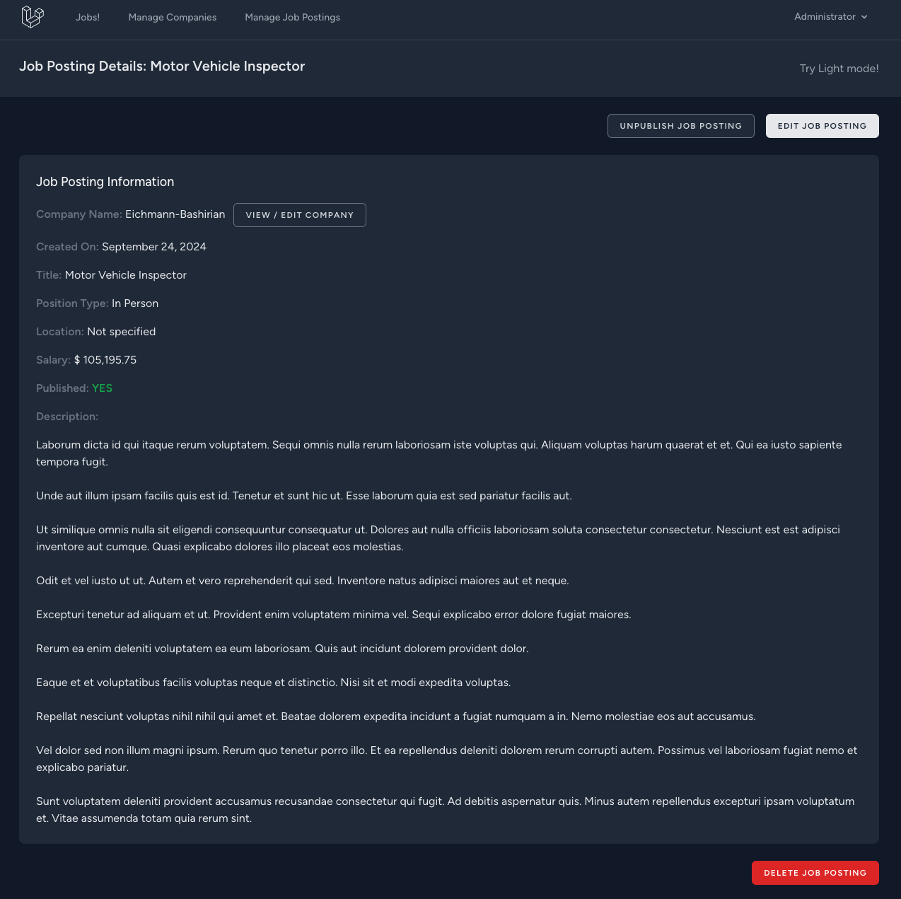
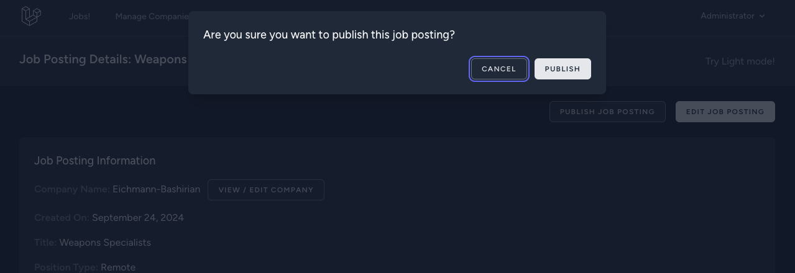
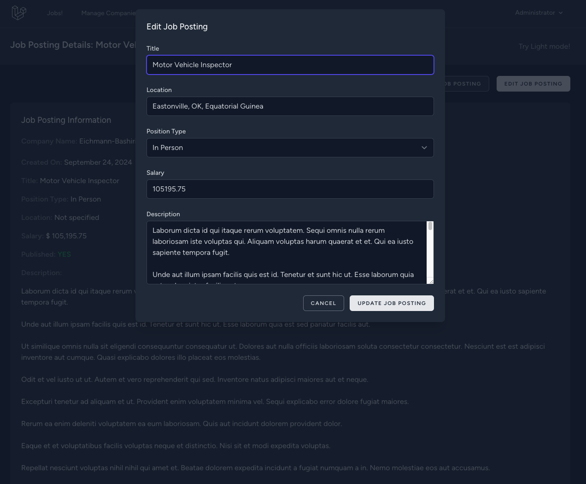

### Last but not least, job posting details page for job seekers

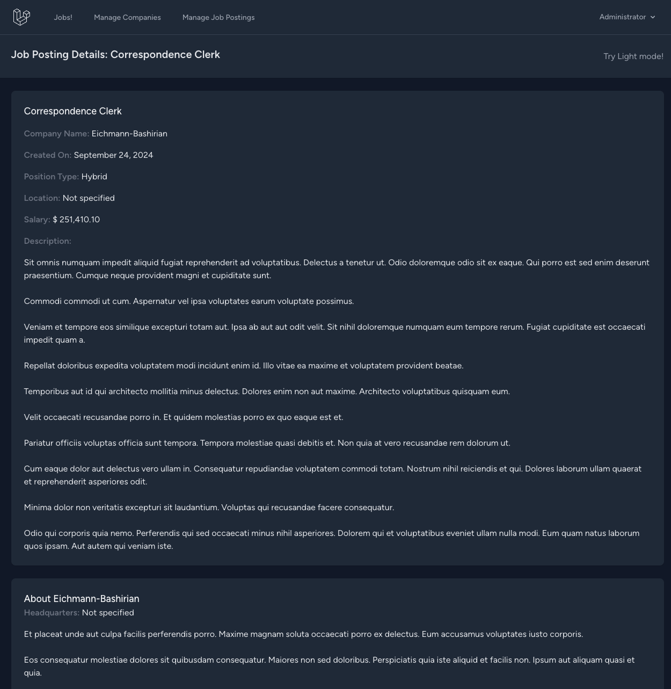

